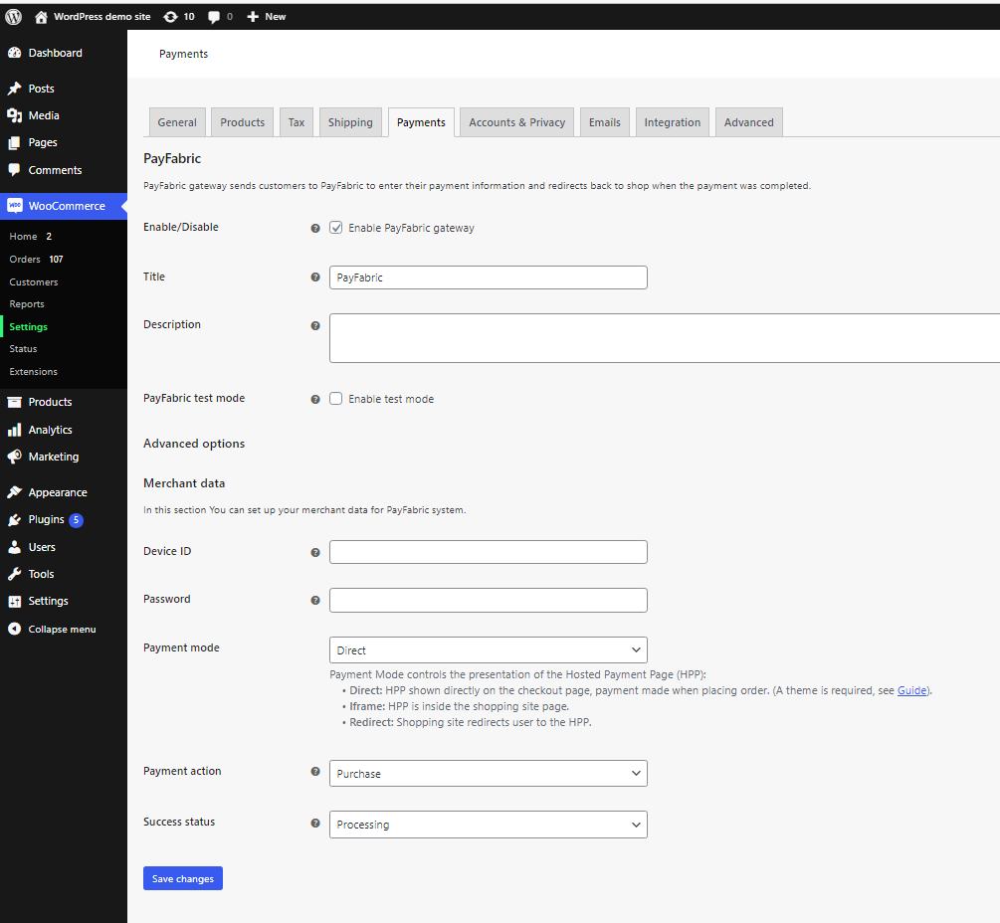
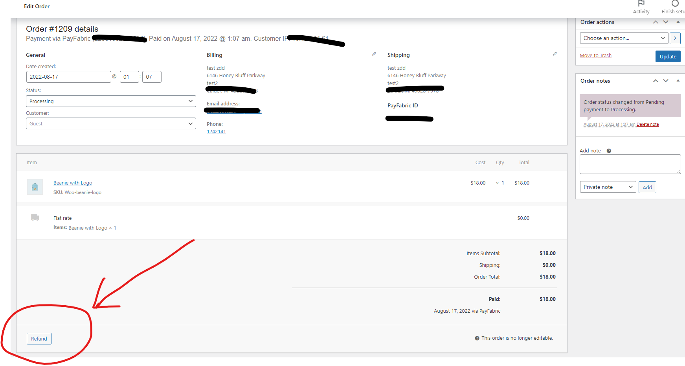
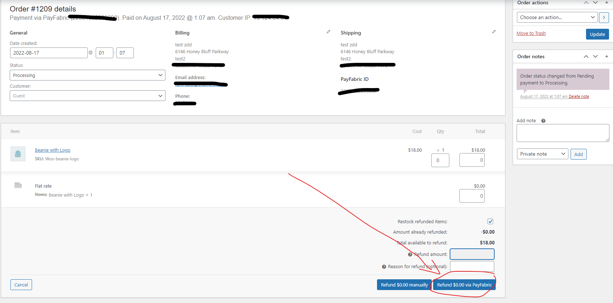

## PayFabric gateway plugin for WooCommerce 
Requires WooCommerce Version: 3.0.0 or higher.

Requires an active PayFabric account. Development can be done on a PayFabric Sandbox account. PayFabric is an EVO Payments processing platform.

## Description 
PayFabric gateway plugin for WooCommerce provides eCommerce extensions that allow you to add PayFabric payment processing capabilities into supported eCommerce platforms without any custom coding.

## Installation 

This section describes how to install the plugin and get it working.

1. Login into the admin area of your website
2. Go to "Plugins" -> "Add New"
3. Click "Upload Plugin" link at the top of the page
4. Click "Browse" and navigate to the plugin's zip file and choose that file.
5. Click "Install Now" button
6. Wait while plugin is uploaded to your server
7. Click "Activate Plugin" button

## Configuration
In the PayFabric Portal, prepare a device with a default gateway configured.
1. Go to Settings > Dev Central > Device Management to create a device to obtain the Device ID and Password.
2. Go to Settings > Gateway Account Configuration, click '+ New Gateway Account' if the payment gateway account is not associated to an existing PayFabric account, and then set the default gateway under Default Gateway Settings.
Please refer to user guide in [PayFabric](https://github.com/PayFabric/Portal/blob/master/PayFabric/README.md "PayFabric").

In your WooCommerce Setting:
* Go to WooCommerce > Settings > Payments > PayFabric to enter your device data.

* Payment mode: When using "Direct" payment mode, you must create a theme to add the following custom js and configure this theme as default theme in the PayFabric Portal(please refer to [PayFabric Themes](https://github.com/PayFabric/Portal/blob/master/PayFabric/Sections/Themes.md "Themes")), please don't do that for other payment modes which will affect your payment UI.
```javascript
$(".BillingContent").hide();
$("#payButton").hide();
typeof (receiveMessage) !== "undefined" && window.removeEventListener("message", receiveMessage, false);
var receiveMessage = function (event)
{
    var data = event.data;
    if(data.match("^\{(.+:.+,*){1,}\}$"))  data = $.parseJSON(data);
    if (data.action == 'pay' ) {
        typeof (data.BillCountryCode) !== "undefined" && $("#BillCountryCode").val($("#BillCountryCode").find("option[value^=" + data.BillCountryCode + "]").val()).trigger('change');
        typeof (data.BillAddressLine1) !== "undefined" && $("#BillAddressLine1").val(data.BillAddressLine1);
        typeof (data.BillAddressLine2) !== "undefined" && $("#BillAddressLine2").val(data.BillAddressLine2);
        typeof (data.BillCityCode) !== "undefined" && $("#BillCityCode").val(data.BillCityCode);
        typeof (data.BillStateCode) !== "undefined" && $(".state").val($("#BillStateCode").find("option[value^=" + data.BillStateCode + "]").val() || data.BillStateCode);
        typeof (data.BillZipCode) !== "undefined" && $("#BillZipCode").val(data.BillZipCode);
        $("#payButton").click();
    }
}
window.addEventListener("message", receiveMessage, false);
```
* Payment Action: Select Purchase for a normal website purchase transaction. This is the default option and automatically executes both the authorization and capture for the transaction. The funds from this transaction will be included in your next batch settlement.
    * If you choose Auth, see the Capture or Void instructions below.
* Click "Save changes" to save Config.

* When using Auth as your Payment Action, you must “Capture” the transaction when the sale has been completed. If you do not “Capture” the Authorization, no funds will be settled as the transaction is not complete.
Or you may “Void” a transaction when the order has been cancelled before being Captured
    * “Capture” or "Void " a transaction: Open the detail of the authorized order and you will see the Order actions dropdown. Select “Capture Online” to capture the Authorization, or “Void Online” to void the Authorization.

* To Refund a Purchase or Captured transaction directly: Open the detail of the captured order.
    * Click on the "Refund" button at the left bottom of the order detail.
    
    * After clicking the "Refund" button, the refund detail section will appear. Click the "Refund xxx via PayFabric" button to refund online.
    
    
## API Documentation
* [API Authentication](sections/Authentication.md)
* [Create a Transaction(Auth or Sale)](sections/Transactions.md)
* [Capture a Pre-Authorized Transaction(Auth)](sections/Capture.md)
* [Void a Transaction(Auth)](sections/Void.md)
* [Refund a Captured Transaction](sections/Refund.md)
* [Retrieve a Transaction](sections/Retrieve.md)
* [Create a Token](sections/Token.md)
* [Hosted Payment Page](sections/PaymentPage.md)

## Support    
Have a question or need help? Contact support@payfabric.com. 
